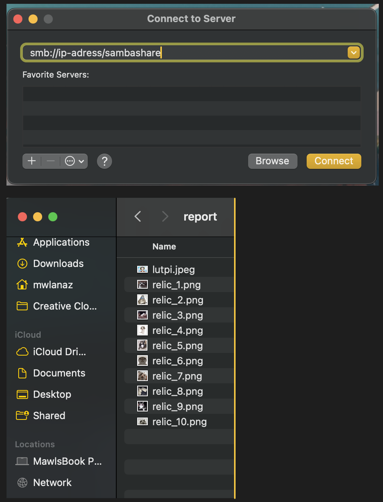

# Laporan Hasil Praktikum Sistem Operasi 2024 Modul 4 - IT02

## Anggota Kelompok IT 02 :

- Maulana Ahmad Zahiri (5027231010)
- Syela Zeruya Tandi Lalong (5027231076)
- Kharisma Fahrun Nisa' (5027231086)

## Daftar Isi

- [Soal 1](#soal-1)
- [Soal 2](#soal-2)
- [Soal 3](#soal-3)

# Soal 1

## Deskripsi Soal

Adfi merupakan seorang CEO agency creative bernama Ini Karya Kita. Ia sedang melakukan inovasi pada manajemen proyek photography Ini Karya Kita. Salah satu ide yang dia kembangkan adalah tentang pengelolaan foto proyek dalam sistem arsip Ini Karya Kita. Dalam membangun sistem ini, Adfi tidak bisa melakukannya sendirian, dia perlu bantuan mahasiswa Departemen Teknologi Informasi angkatan 2023 untuk membahas konsep baru yang akan mengubah proyek fotografinya lebih menarik untuk dilihat.

Adfi telah menyiapkan portofolio hasil proyek fotonya yang bisa diunduh dan diakses di www.inikaryakita.id. Silakan eksplorasi web Ini Karya Kita dan temukan halaman untuk bisa mengunduh proyeknya. Setelah Anda unduh, terdapat folder `gallery` dan `bahaya`.

1. Pada folder `gallery`:

   - Membuat folder dengan prefix "wm." Dalam folder ini, setiap gambar yang dipindahkan ke dalamnya akan diberikan watermark bertuliskan `inikaryakita.id`.
   - Contoh: `mv ikk.jpeg wm-foto/`
   - Output:
     - Before: (tidak ada watermark bertuliskan `inikaryakita.id`)
     - After: (terdapat watermark tulisan `inikaryakita.id`)

2. Pada folder `bahaya`, terdapat file bernama `script.sh`. Adfi menyadari pentingnya menjaga keamanan dan integritas data dalam folder ini. Mereka harus mengubah permission pada file `script.sh` agar bisa dijalankan, karena jika dijalankan maka dapat menghapus semua isi dari `gallery`.

3. Adfi dan timnya juga ingin menambahkan fitur baru dengan membuat file dengan prefix `test` yang ketika disimpan akan mengalami pembalikan (reverse) isi dari file tersebut.

## Pengerjaan

### Watermark pada Foto

1. **Membuat Folder Watermark**

   - Buat folder dengan prefix `wm.` di dalam folder `gallery`.
   - Contoh: `mkdir gallery/wm-foto`

2. **Menambahkan Watermark pada Foto**

   - Pindahkan foto yang akan diberi watermark ke dalam folder `wm.`.
   - Contoh: `mv gallery/ikk.jpeg gallery/wm-foto/`

3. **Kode C untuk Menambahkan Watermark**

   ```c
   #include <opencv2/opencv.hpp>

   void addWatermark(const char* inputImagePath, const char* outputImagePath) {
       cv::Mat image = cv::imread(inputImagePath);
       if (image.empty()) {
           printf("Gagal membuka gambar\n");
           return;
       }

       std::string text = "inikaryakita.id";
       int fontFace = cv::FONT_HERSHEY_SIMPLEX;
       double fontScale = 1;
       int thickness = 2;
       cv::Point textOrg(10, image.rows - 10);

       cv::putText(image, text, textOrg, fontFace, fontScale, cv::Scalar::all(255), thickness, 8);
       cv::imwrite(outputImagePath, image);
   }

   int main() {
       addWatermark("gallery/ikk.jpeg", "gallery/wm-foto/ikk_watermarked.jpeg");
       return 0;
   }
   ```

# Soal 2

## Deskripsi Soal

CEO Ini Karya Kita ingin melakukan tes keamanan pada folder 'sensitif' Ini Karya Kita. CEO Ini Karya Kita ingin meminta bantuan pada mahasiswa Teknologi Informasi 2023 untuk menguji dan mengatur keamanan pada folder 'sensitif' tersebut. Di dalam folder tersebut, terdapat 2 folder lagi yang bernama 'pesan' dan 'rahasia-berkas':

- Pada folder "pesan" Adfi ingin meningkatkan kemampuan sistemnya dalam mengelola berkas-berkas teks dengan menggunakan fuse.
- Kemudian, pada folder “rahasia-berkas”, Adfi dan timnya memutuskan untuk menerapkan kebijakan khusus. Mereka ingin memastikan bahwa folder dengan prefix "rahasia" tidak dapat diakses tanpa izin khusus
- Setiap proses yang dilakukan akan tercatat pada logs-fuse.log

## Pengerjaan

```c
void log_action(const char *status, const char *action, const char *info) {
    time_t now;
    struct tm *local_time;
    char timestamp[20];

    time(&now);
    local_time = localtime(&now);
    strftime(timestamp, sizeof(timestamp), "%d/%m/%Y-%H:%M:%S", local_time);

    FILE *log_file = fopen("logs-fuse.log", "a");
    if (log_file == NULL) {
        perror("Failed to open log file");
        exit(EXIT_FAILURE);
    }

    fprintf(log_file, "[%s]::%s::%s::%s\n", status, timestamp, action, info);
    fclose(log_file);
}
```

Fungsi `log_action` untuk mencatat tindakan dan status ke file log dengan timestamp. Ini digunakan untuk mencatat keberhasilan atau kegagalan operasi dekripsi.

```c
char *base64_decode(const char *input, int length, int *out_len) {
    BIO *bio, *b64;
    int decodeLen = (length * 3) / 4;
    char *buffer = (char *)malloc(decodeLen + 1);
    memset(buffer, 0, decodeLen + 1);

    bio = BIO_new_mem_buf(input, length);
    b64 = BIO_new(BIO_f_base64());
    bio = BIO_push(b64, bio);

    *out_len = BIO_read(bio, buffer, length);
    buffer[*out_len] = '\0';

    BIO_free_all(bio);

    return buffer;
}
```

Fungsi `base64_decode` untuk mendekode string yang dikodekan dalam format Base64

```c
void rot13_decode(char *str) {
    while (*str) {
        if (isalpha(*str)) {
            if ((*str >= 'a' && *str <= 'm') || (*str >= 'A' && *str <= 'M'))
                *str += 13;
            else
                *str -= 13;
        }
        str++;
    }
}
```

Fungsi `rot13_decode` untuk mendekode string yang dikodekan dengan metode ROT13, yaitu mengganti setiap huruf dengan huruf yang berada 13 posisi di depannya dalam alfabet

```c
char *hex_decode(const char *input, int length) {
    int len = length / 2;
    char *output = (char *)malloc(len + 1);
    memset(output, 0, len + 1);

    for (int i = 0; i < len; i++) {
        sscanf(input + 2 * i, "%2hhx", &output[i]);
    }

    return output;
}
```

Fungsi `hex_decode` untuk mendekode string yang dikodekan dalam format heksadesimal

```c
void reverse_string(char *str) {
    int length = strlen(str);
    char *start = str;
    char *end = str + length - 1;

    while (start < end) {
        char temp = *start;
        *start = *end;
        *end = temp;
        start++;
        end--;
    }
}
```

Fungsi `reverse_string` untuk membalikkan string

```c
void decrypt_content(char *content, int length) {
    if (strncmp(content, "base64,", 7) == 0) {
        int out_len;
        char *decoded = base64_decode(content + 7, length - 7, &out_len);
        memmove(content, decoded, out_len + 1);
        free(decoded);
        log_action("SUCCESS", "base64Decode", "Base64 decoded successfully");
    } else if (strncmp(content, "rot13,", 6) == 0) {
        rot13_decode(content + 6);
        memmove(content, content + 6, length - 5);
        log_action("SUCCESS", "rot13Decode", "ROT13 decoded successfully");
    } else if (strncmp(content, "hex,", 4) == 0) {
        char *decoded = hex_decode(content + 4, length - 4);
        strcpy(content, decoded);
        free(decoded);
        log_action("SUCCESS", "hexDecode", "Hex decoded successfully");
    } else if (strncmp(content, "rev,", 4) == 0) {
        reverse_string(content + 4);
        memmove(content, content + 4, length - 3);
        log_action("SUCCESS", "reverseDecode", "Reverse decoded successfully");
    } else {
        log_action("FAILED", "decode", "Unsupported encoding prefix");
    }
}
```

Fungsi `decrypt_content` menentukan metode dekripsi yang tepat berdasarkan prefix string dan kemudian mendekode string tersebut. Prefix yang dikenali adalah `base64`, `rot13`, `hex`, dan `rev`

```c
static int xmp_getattr(const char *path, struct stat *stbuf) {
    int res;
    char fpath[1000];
    snprintf(fpath, sizeof(fpath), "%s%s", pesan_dir, path);
    res = lstat(fpath, stbuf);
    if (res == -1)
        return -errno;

    return 0;
}
```

Fungsi `xmp_getattr` untuk membaca atribut file seperti ukuran, waktu modifikasi, dll., menggunakan fungsi `lstat`

```c
static int xmp_readdir(const char *path, void *buf, fuse_fill_dir_t filler, off_t offset, struct fuse_file_info *fi) {
    DIR *dp;
    struct dirent *de;
    char fpath[1000];

    snprintf(fpath, sizeof(fpath), "%s%s", pesan_dir, path);
    dp = opendir(fpath);
    if (dp == NULL)
        return -errno;

    while ((de = readdir(dp)) != NULL) {
        struct stat st;
        memset(&st, 0, sizeof(st));
        st.st_ino = de->d_ino;
        st.st_mode = de->d_type << 12;
        if (filler(buf, de->d_name, &st, 0))
            break;
    }

    closedir(dp);
    return 0;
}
```

Fungsi `xmp_readdir` untuk membaca isi direktori dan mengisi buffer dengan nama-nama file dan direktori yang ada

```c
static int xmp_open(const char *path, struct fuse_file_info *fi) {
    int res;
    char fpath[1000];

    snprintf(fpath, sizeof(fpath), "%s%s", pesan_dir, path);
    res = open(fpath, fi->flags);
    if (res == -1)
        return -errno;

    close(res);
    return 0;
}
```

Fungsi `xmp_open` untuk membuka file

```c
static int xmp_read(const char *path, char *buf, size_t size, off_t offset,
                    struct fuse_file_info *fi) {
    int fd;
    int res;
    char fpath[1000];
    char *content;

    snprintf(fpath, sizeof(fpath), "%s%s", pesan_dir, path);
    fd = open(fpath, O_RDONLY);
    if (fd == -1)
        return -errno;

    content = (char *)malloc(size + 1);
    if (!content) {
        close(fd);
        return -ENOMEM;
    }

    res = pread(fd, content, size, offset);
    if (res == -1) {
        free(content);
        close(fd);
        return -errno;
    }

    content[res] = '\0';
    decrypt_content(content, res);
    memcpy(buf, content, res);
    free(content);
    close(fd);
    return res;
}
```

Fungsi `xmp_read` untuk membaca isi file

```c
static struct fuse_operations xmp_oper = {
    .getattr    = xmp_getattr,
    .readdir    = xmp_readdir,
    .open       = xmp_open,
    .read       = xmp_read,
};
```

Struktur `fuse_operations` menghubungkan fungsi-fungsi yang telah didefinisikan dengan operasi FUSE yang sesuai

```c
int main(int argc, char *argv[]) {
    return fuse_main(argc, argv, &xmp_oper, NULL);
}
```

Fungsi `main` memanggil `fuse_main` untuk memulai sistem file FUSE dengan operasi yang telah ditentukan

## Dokumentasi

# Soal 3

`> Maulana`

## Deskripsi Soal

Seorang arkeolog menemukan sebuah gua yang didalamnya tersimpan banyak relik dari zaman praaksara, sayangnya semua barang yang ada pada gua tersebut memiliki bentuk yang terpecah belah akibat bencana yang tidak diketahui.

Sang arkeolog ingin menemukan cara cepat agar ia bisa menggabungkan relik-relik yang terpecah itu, namun karena setiap pecahan relik itu masih memiliki nilai tersendiri, ia memutuskan untuk membuat sebuah file system yang mana saat ia mengakses file system tersebut ia dapat melihat semua relik dalam keadaan utuh, sementara relik yang asli tidak berubah sama sekali.

## Pengerjaan

jadi yang paling awal yakni membuat direktori seperti pada soal yakni:


dimana pada `nama_bebas` saya menamainya dengan fuze, dimana nantinya akan menjadi direktori fuse dengan yang direktori asalnya adalah direktori relics.

dan sebelumnya kita disediakan link untuk mendownload file relics yang diperlukan, yakni kira mendownloadnya dengan cara:

```
curl -L -o '[link download file]'
```

dimana pada bagian dalam kurung siku diisi dengan link untuk file yang akan di download.

kemudian untuk selanjutnya kita akan men settingnya sesuai dengan permintaan soal.

untuk yang pertama, yakni kita membuat program archeology.c dimana berisi fungsi-fungsi terkait dengan penyelesaian soal.

```c
#define FUSE_USE_VERSION 28
#include <fuse.h>
#include <stdio.h>
#include <string.h>
#include <unistd.h>
#include <fcntl.h>
#include <dirent.h>
#include <errno.h>
#include <sys/time.h>
#include <stdlib.h>

static const char *relics_path = "/Users/mwlanaz/Desktop/praktikum/praktikum-sisop/modul-4/soal_3/relics"; // Ganti dengan path ke direktori relics
static const char *fuze_path = "/Users/mwlanaz/Desktop/praktikum/praktikum-sisop/modul-4/soal_3/fuze"; // Ganti dengan path ke direktori fuze

// Deklarasi fungsi-fungsi yang akan digunakan
static int split_file(const char *path);
static int xmp_combine_files(const char *relic_name);
static int delete_parts(const char *path);
```

pada program tersebut kurang lebih merupakan sebuah deklarasi dan juga memberitahu tentang dimana file tersebut disimpan.

```c
static int xmp_getattr(const char *path, struct stat *stbuf) {
    int res;
    char fpath[1000];
    sprintf(fpath, "%s%s", relics_path, path); // Mengubah ke direktori asal untuk akses ke relics

    if (access(fpath, F_OK) == 0) {
        res = lstat(fpath, stbuf);
    } else {
        sprintf(fpath, "%s%s", fuze_path, path); // Mengubah ke fuze_path untuk akses gabungan
        res = lstat(fpath, stbuf);
    }

    if (res == -1) return -errno;
    return 0;
}

static int xmp_readdir(const char *path, void *buf, fuse_fill_dir_t filler, off_t offset, struct fuse_file_info *fi) {
    char fpath[1000];
    if (strcmp(path, "/") == 0)
        path = fuze_path;
    else
        sprintf(fpath, "%s%s", fuze_path, path);

    if (strcmp(path, fuze_path) == 0) {
        DIR *dp;
        struct dirent *de;
        (void)offset;
        (void)fi;

        dp = opendir(relics_path); // Buka direktori relics
        if (dp == NULL) return -errno;

        while ((de = readdir(dp)) != NULL) {
            // Skip pecahan file
            if (strchr(de->d_name, '.') && de->d_name[strlen(de->d_name) - 4] == '.') {
                continue;
            }
            struct stat st;
            memset(&st, 0, sizeof(st));
            st.st_ino = de->d_ino;
            st.st_mode = de->d_type << 12;
            if (filler(buf, de->d_name, &st, 0))
                break;
        }

        closedir(dp);
    } else {
        DIR *dp;
        struct dirent *de;
        (void)offset;
        (void)fi;

        dp = opendir(fpath);
        if (dp == NULL) return -errno;

        while ((de = readdir(dp)) != NULL) {
            struct stat st;
            memset(&st, 0, sizeof(st));
            st.st_ino = de->d_ino;
            st.st_mode = de->d_type << 12;
            if (filler(buf, de->d_name, &st, 0))
                break;
        }

        closedir(dp);
    }

    return 0;
}

static int xmp_read(const char *path, char *buf, size_t size, off_t offset, struct fuse_file_info *fi) {
    char fpath[1000];
    sprintf(fpath, "%s%s", relics_path, path); // Mengubah ke direktori asal untuk akses ke relics

    int fd;
    int res;
    (void)fi;

    fd = open(fpath, O_RDONLY);
    if (fd == -1) return -errno;

    res = pread(fd, buf, size, offset);
    if (res == -1) res = -errno;

    close(fd);
    return res;
}

static int xmp_write(const char *path, const char *buf, size_t size, off_t offset, struct fuse_file_info *fi) {
    // Simpan sementara di direktori fuze
    char temp_fpath[1000];
    sprintf(temp_fpath, "%s%s", fuze_path, path);

    int fd = open(temp_fpath, O_WRONLY | O_CREAT, 0644);
    if (fd == -1) return -errno;

    int res = pwrite(fd, buf, size, offset);
    if (res == -1) res = -errno;

    close(fd);

    // Setelah menulis, pecah file dan pindahkan ke relics
    res = split_file(path);
    if (res != 0) return res;

    // Hapus file sementara
    unlink(temp_fpath);

    return size;
}
```

kemudian setelah itu juga terdapat beberapa fungsi contoh nya fungsi untuk membaca, menulis, dan menginisiasi file.

```c
static int xmp_combine_files(const char *relic_name) {
    char combined_file_path[1000];
    sprintf(combined_file_path, "%s/%s", fuze_path, relic_name);

    FILE *output_file = fopen(combined_file_path, "w");
    if (output_file == NULL) {
        perror("Failed to open output file for combining");
        return -errno;
    }

    char part_file_path[1000];
    int part_number = 0;
    while (1) {
        sprintf(part_file_path, "%s/%s.%03d", relics_path, relic_name, part_number);
        FILE *input_file = fopen(part_file_path, "r");
        if (input_file == NULL) break;

        char buffer[10240]; // 10 KB buffer
        size_t bytes_read;
        while ((bytes_read = fread(buffer, 1, sizeof(buffer), input_file)) > 0) {
            fwrite(buffer, 1, bytes_read, output_file);
        }

        fclose(input_file);
        part_number++;
    }

    fclose(output_file);
    return 0;
}

static struct fuse_operations xmp_oper = {
    .getattr = xmp_getattr,
    .readdir = xmp_readdir,
    .read = xmp_read,
    .write = xmp_write,
    .create = xmp_create,
    .unlink = xmp_unlink,
};

static void combine_all_files() {
    // Gabungkan file-file pecahan menjadi 10 file gabungan
    for (int i = 1; i <= 10; i++) {
        char relic_name[100];
        sprintf(relic_name, "relic_%d.png", i);
        xmp_combine_files(relic_name);
    }
}
```

kemudian juga terdapat fungsi untuk menyatukan beberapa pecahan gambar pada direktori relics, yang akan tergabung melalui fuse pada direktori fuze.

sehingga apabila dilakukan listing file, maka akan menampilkan file yang tergabung dalam direktori fuze, dan file yang terpecah pada direktori relics.

```c

static int split_file(const char *path) {
    char temp_fpath[1000];
    sprintf(temp_fpath, "%s%s", fuze_path, path); // Path ke file sementara di direktori fuze

    FILE *input_file = fopen(temp_fpath, "rb");
    if (input_file == NULL) {
        perror("Failed to open input file");
        return -errno;
    }

    fseek(input_file, 0, SEEK_END);
    long file_size = ftell(input_file);
    fseek(input_file, 0, SEEK_SET);

    if (file_size <= 0) {
        fclose(input_file);
        printf("File is empty or error getting file size: %s\n", temp_fpath);
        return 0;
    }

    printf("Splitting file: %s of size %ld bytes\n", temp_fpath, file_size);

    char part_file_path[1000];
    int part_number = 0;
    size_t total_bytes_read = 0;
    while (total_bytes_read < file_size) {
        sprintf(part_file_path, "%s/%s.%03d", relics_path, path, part_number);
        FILE *output_file = fopen(part_file_path, "wb");
        if (output_file == NULL) {
            perror("Failed to open output file");
            fclose(input_file);
            return -errno;
        }

        char buffer[10240]; // 10 KB buffer
        size_t bytes_read = fread(buffer, 1, sizeof(buffer), input_file);
        if (bytes_read > 0) {
            fwrite(buffer, 1, bytes_read, output_file);
            total_bytes_read += bytes_read;
            printf("Written %zu bytes to %s\n", bytes_read, part_file_path);
        }

        fclose(output_file);
        part_number++;
    }

    fclose(input_file);

    printf("Total bytes read: %zu\n", total_bytes_read);
    printf("Split file completed.\n");

    return 0;
}


static int delete_parts(const char *path) {
    char fpath[1000];
    sprintf(fpath, "%s%s", relics_path, path); // Path ke file di direktori relics

    char part_file_path[1000];
    for (int i = 0; ; i++) {
        sprintf(part_file_path, "%s.%03d", fpath, i);
        if (access(part_file_path, F_OK) != 0) break; // Stop jika tidak ada lagi pecahan

        if (remove(part_file_path) != 0) {
            perror("Failed to remove part file");
            return -errno;
        } else {
            printf("Removed part file %s\n", part_file_path);
        }
    }

    printf("All part files removed for %s\n", fpath);
    return 0;
}
```

pada program diatas terdapat fungsi untuk memecah file dan juga menghapus file.

yakni apabila kita mengupload file dengan ukuran diatas 10 kb dan menaruhnya pada direktori fuze, maka akan dilakukan pemecahan pada direktori relics sehingga menampilkan banyak jumah pecahan dengan format `[namafile].000` .

kemudian apabila kita menghapus file tersebut, maka pecahan file tersebut juga kan ikut terhapus.


sebagai contoh saat saya mengupload file lutpi dengan ukuran 18 kb , maka akan terpecah menjadi 2 gambar, dimana berukuran 10kb, dan satunya 8 kb.


pada gambar diatas merupakan list pada direktori report yang sebelumnya disalin dari direktori fuze.


gambar diatas meupakan list dari direktori report jika dilihat melalui finder pada mac.

sekian terimakasih.

## Dokumentasi


Berhasil di compile dan di run Tanpa ada masalah mounting


tampilan direktori fuze setelah berhasil menggabungkan


Berhasil menampilkan pecahan relics


berhasil memuat dan menyalin direktori fuze ke direktori report

## beberapa error sebelumnya


saat elum berhasil menampilkan pecahan dari gambar yang diupload, kemudian setelah di coba dengan menambahkan fungsi diatas dapat berjalan dengan baik.


fuse belum berjalan, dan kemudian setelah di lengkapi dengan fungsi fuse diatas dapat berjalan dengan baik.
